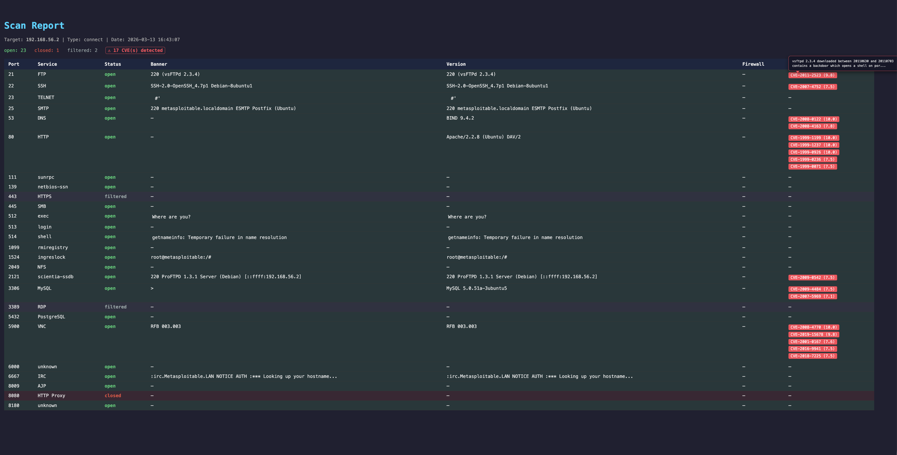

# Network Port Scanner

A Python TCP port scanner with interactive CLI, SYN stealth mode, host discovery, automated CVE lookup, OS and version detection, firewall fingerprinting, and Nmap-compatible reports. Built as a 4-day team project during the BeCode Brussels Blue & Red Team bootcamp.

[](https://github.com/Jhatchi/Network-Port-Scanner-BC-2026/actions/workflows/tests.yml)
[](docs/testing.md)
[](requirements.txt)
[](docs/architecture.md)
[](LICENSE)
[](https://www.linkedin.com/in/johan-emmanuel-hatchi/)

## Screenshot



HTML report from a real scan against Metasploitable 2 (192.168.56.2). Shows 23 open ports, banner/version detection, and 17 CVEs auto-discovered via the NVD API. Hover any CVE badge in the actual report for severity and description.

## ⚠ Legal disclaimer

**For educational and lab use only, on systems you own or have explicit written authorization to test.**

Scanning a network or machine without authorization is **illegal** in Belgium (law of 28 November 2000 on computer crime, articles 550bis and 550ter), in France (Penal Code articles 323-1 to 323-7), and across the EU under the NIS2 directive (2022/2555). The same restrictions apply in most jurisdictions.

**Authorized contexts:**

- Your own infrastructure (personal machine, personal server, home lab)
- An isolated lab network (VM, containerized lab, Metasploitable, HackTheBox VPN)
- A pentest engagement with a signed contract defining scope
- A bug bounty program with a published scope

**Prohibited:**

- Scanning public servers without permission
- Scanning a company's, school's, or ISP's network without written authorization
- Using scan results to exploit vulnerabilities on third-party systems

The authors disclaim all responsibility in case of misuse. Use the included `--randomize`, `--max-rate`, `--jitter` and `--delay` flags responsibly: they exist to reduce load and avoid harming the target, not to evade detection by systems you have no right to scan.

## What it does

- **Scans TCP ports** in two modes: standard `connect` (no privileges) or stealth `SYN` (raw packets via scapy, requires sudo). Hundreds of ports in parallel via `ThreadPoolExecutor`.
- **Enriches each open port** with service name, banner, software version (HTTP, SSH, MySQL, DNS, VNC, Redis, IRC, PostgreSQL and more), OS fingerprint (TTL-based), and firewall type (silent DROP vs active REJECT).
- **Looks up CVEs automatically** against the NIST NVD API for detected versions, then exports everything to Nmap-compatible XML, HTML (with CVE tooltips), JSON, CSV or TXT.

## Tech stack

**Core (Python standard library):** `socket`, `concurrent.futures.ThreadPoolExecutor`, `ipaddress`, `subprocess`, `threading`, `argparse`, `json`, `csv`, `html`, `xml.etree.ElementTree`
**Optional:** `scapy` (raw packets for SYN scan, ARP discovery, OS and firewall detection), `tqdm` (progress bar), `requests` (NVD API for CVE lookup)
**Dev:** `pytest`
**Platforms:** Linux, macOS, Windows (Windows needs Npcap for scapy)

## Quick start

```bash
git clone https://github.com/Jhatchi/Network-Port-Scanner-BC-2026.git && cd Network-Port-Scanner-BC-2026
python3 -m venv .venv && source .venv/bin/activate && pip install -r requirements.txt
python cli.py    # interactive wizard, OR: python main.py --target 192.168.1.1 --ports 22,80,443 --output scan.html
```

**SYN stealth scan** (requires sudo on Linux/macOS, admin + Npcap on Windows):

```bash
sudo $(pwd)/.venv/bin/python main.py --target 192.168.1.1 --ports 1-1024 --scan-type syn --output scan.html
```

Full per-OS instructions in [USAGE_GUIDE.md](USAGE_GUIDE.md).

## Team and contributions

Four-day BeCode bootcamp team project. Three contributors, distinct responsibilities:

| Contributor | Scope | Where to look |
|---|---|---|
| **[Johan-Emmanuel Hatchi](https://github.com/Jhatchi)** | Architecture, scan engine (`scanner.py`), reporting layer (`output.py`), interactive CLI (`cli.py`), test suite (76 tests), cross-platform compatibility, integration | Main branch, full commit history |
| **Mike** ([Mike00001](https://github.com/Mike00001)) | CVE reporting integration: changes to `cli.py`, `main.py`, `output.py` to surface vulnerabilities in the HTML/JSON/CSV outputs | Branch [`Mike_dev`](https://github.com/Jhatchi/Network-Port-Scanner-BC-2026/tree/Mike_dev) (kept unmerged to preserve original commit authorship) |
| **Gaëtan** ([Gaetan5555](https://github.com/Gaetan5555)) | Service detection (protocol-specific version probes design) | Code shared via messages due to a Git branching setup issue, integrated into the main branch under Johan's commits |

### Why the single-author git history on `main`

A look at `git log main` shows commits by a single author. This is a deliberate consequence of the collaboration model, not a misattribution:

- Mike worked on his own branch (`Mike_dev`), which was not merged into `main` because his work was experimental and superseded by later iterations. **His branch is preserved on this repo so his commits remain visible under his own GitHub identity.**
- Gaëtan could not push to his own branch due to a local Git configuration issue. He shared his contributions via direct messages, which were then integrated by Johan into the main branch.

This is acknowledged openly here because honest attribution matters more than appearing to have managed the branching perfectly.

## Architecture

Six Python modules with single responsibilities:

| Module | Role |
|---|---|
| [`scanner.py`](scanner.py) | Scan engine: TCP connect + SYN, banner grab, version probes, OS / firewall detection, threaded execution |
| [`discovery.py`](discovery.py) | Host discovery via ARP sweep (scapy) or ICMP ping fallback |
| [`output.py`](output.py) | Report writers: TXT, JSON, CSV, HTML (with CVE tooltips), Nmap-compatible XML |
| [`vuln_analyzer.py`](vuln_analyzer.py) | NVD API client, CVE lookup with in-memory cache, CVSS >= 7.0 filter |
| [`main.py`](main.py) | CLI entry point: input validation, pipeline orchestration, multi-host fan-out |
| [`cli.py`](cli.py) | Interactive wizard layered on top of `main.py`, profiles and speed presets |

Full module reference, interaction diagram, dependency table and CLI options in [`docs/architecture.md`](docs/architecture.md).

## Features

<details>
<summary><strong>Detection</strong> (5 flags)</summary>

| Flag | Effect |
|---|---|
| `--banner` | Passive banner grab on open ports (SSH, FTP, SMTP, ...) |
| `--version-detect` | Protocol-specific probes (HTTP HEAD, SMTP EHLO, MySQL greeting, DNS version.bind, VNC RFB, Redis INFO, IRC, PostgreSQL, ...) |
| `--os-detect` | TTL fingerprinting via raw packets. Requires scapy + sudo |
| `--firewall-detect` | Distinguishes `filtered-silent` (DROP) from `filtered-active` (ICMP REJECT). Requires scapy + sudo |
| `--vuln-scan` | Looks up CVEs via NIST NVD API, CVSS >= 7.0, in-memory cache to avoid duplicate calls |

</details>

<details>
<summary><strong>Performance and stealth</strong> (6 flags)</summary>

| Flag | Effect |
|---|---|
| `--threads N` | Parallel connections (default 100). 400 on LAN, 50 over the internet |
| `--timeout S` | Per-port timeout in seconds (default 1.0). 0.3 on LAN, 1-2 over the internet |
| `--randomize` | Shuffle port order. Defeats sequential-scan IDS signatures |
| `--max-rate N` | Global ceiling in packets per second, via shared lock across threads. More precise than `--delay` |
| `--jitter S` | Random delay 0-S seconds between probes. Avoids regular timing patterns |
| `--delay S` | Fixed pause between probes in each thread (simpler than `--max-rate`) |

</details>

<details>
<summary><strong>Workflow</strong></summary>

| Flag | Effect |
|---|---|
| `--target` | IP, IPv6, hostname or CIDR (`192.168.1.0/24`) |
| `--ports` | `22,80,443` or `1-1024` or any combination |
| `--scan-type` | `connect` (default) or `syn` |
| `--discover` | ARP sweep (scapy) or ICMP ping before scanning, to avoid wasting time on dead IPs |
| `--output` | `.txt`, `.json`, `.csv`, `.html`, `.xml` (Nmap-compatible) |

</details>

Full per-flag walkthrough with examples in [USAGE_GUIDE.md](USAGE_GUIDE.md).

## Documentation

| Doc | What it covers |
|---|---|
| [USAGE_GUIDE.md](USAGE_GUIDE.md) | Per-OS install, interactive vs CLI flow, SYN scan setup on Linux/macOS/Windows |
| [docs/architecture.md](docs/architecture.md) | Full module reference, interaction diagram, dependency table, CLI options |
| [docs/walkthrough-statistics-summary.md](docs/walkthrough-statistics-summary.md) | Line-by-line walkthrough of the `print_summary()` function |
| [docs/testing.md](docs/testing.md) | Test coverage breakdown across the 76 tests in 5 files |
| [docs/cli-demo.md](docs/cli-demo.md) | Text capture of the interactive CLI flow (questions and answers) |
| [docs/ethics.md](docs/ethics.md) | Detailed legal framework, authorized uses, detection patterns |
| [docs/technical-report.md](docs/technical-report.md) | Full project technical report (protocols, scan modes, packet analysis) |
| [docs/design-history/](docs/design-history/) | Original design and implementation plan, kept as-built archive |

## Known limits

- **No TLS / HTTPS probe.** `--version-detect` on port 443 falls back to a generic `\r\n` probe because the underlying library does not do a TLS handshake. Adding `ssl.wrap_socket` is the obvious next step.
- **Scapy required for advanced features.** SYN scan, OS detection, firewall fingerprinting and ARP discovery all need `scapy` + sudo. On Windows, this also means installing Npcap. Standard TCP connect scan needs none of this.
- **NVD cache is in-memory only.** CVE lookups are cached within a single scan run, but not persisted between runs. Repeated scans of the same target hit the NVD API again. Persistent cache (SQLite or JSON) is a one-evening addition.
- **ARP discovery is single-segment.** ARP cannot cross routers, so `--discover` on a `/16` falls back to ICMP ping for hosts outside the local Ethernet segment.
- **No coverage measurement.** 76 tests pass, but `pytest-cov` is not configured. Coverage % is unmeasured (and almost certainly lower than it looks because of the heavy use of mocks).
- **No retry / backoff on transient errors.** A port that briefly drops a SYN-ACK due to a transient packet loss is classified `filtered`. A real penetration testing tool would retry with a different jitter. We did not.

## License

[MIT](LICENSE), 2026 Johan-Emmanuel Hatchi and contributors.

## About

Four-day team project built during the [BeCode Brussels](https://becode.org) Blue & Red Team bootcamp (November 2025 to September 2026). Lead and integration: **[Johan-Emmanuel Hatchi](https://github.com/Jhatchi)** ([LinkedIn](https://www.linkedin.com/in/johan-emmanuel-hatchi/)). Contributors: [Mike](https://github.com/Mike00001), [Gaëtan](https://github.com/Gaetan5555).

Open to cybersecurity internship opportunities starting September 2026 in Belgium.
